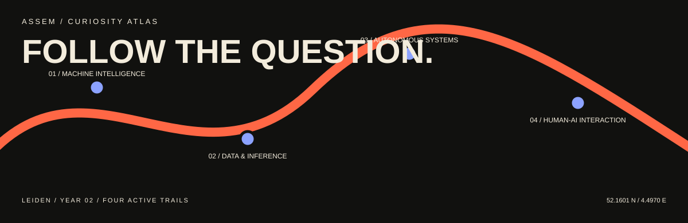

**Data Science & AI student at Leiden University, entering year two.**  
Interested in how intelligent systems learn, reason, act, and meet the people using them.

*Following questions, not a fixed destination.*
