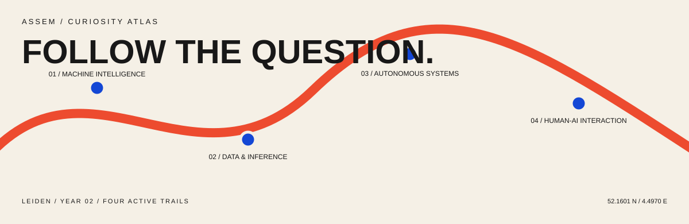

<picture>
  <source media="(prefers-color-scheme: dark)" srcset="assets/atlas-dark.svg">
  <source media="(prefers-color-scheme: light)" srcset="assets/atlas-light.svg">
  
</picture>

**Data Science & AI student at Leiden University, entering year two.**  
Interested in how intelligent systems learn, reason, act, and meet the people using them.

## `01 / CURRENT COORDINATES`

| Active trail | Following |
| --- | --- |
| **Machine intelligence** | Models, reasoning, learning, adaptation. |
| **Data & inference** | Patterns, uncertainty, evidence, explanation. |
| **Autonomous systems** | Agents, decisions, algorithms, feedback. |
| **Human-AI interaction** | Cognition, interfaces, usefulness, trust. |

## `02 / QUESTIONS IN MOTION`

↗ When should an intelligent system explain itself?  
↗ What separates useful autonomy from unnecessary automation?  
↗ How do people calibrate trust in imperfect models?

## `03 / FIELD NOTES`

### [Structured learning interface](https://github.com/Assem130/arabic-word-of-the-day)

Exploring structured content, browser state, and human-centred interface decisions.

### [University authentication automation](https://github.com/Assem130/AutoULCN-Firefox)

A public fork exploring browser and scripting approaches to a repetitive university login flow.

---

*Following questions, not a fixed destination.*
